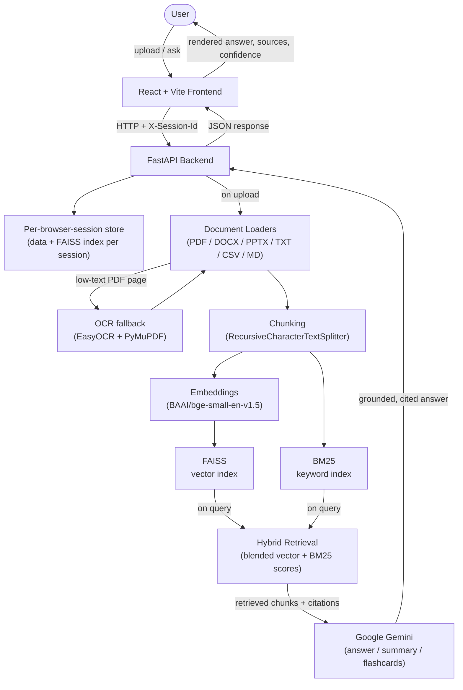

# LocalDocs AI Assistant


A **Retrieval-Augmented Generation (RAG)** application that lets you upload your own documents and have a grounded conversation with them. Every answer is backed by hybrid retrieval (semantic + keyword search) over your uploaded files and generated by Google Gemini — with source citations, confidence scores, document summaries, and auto-generated flashcards.

Built as a **React + Vite frontend** talking to a **FastAPI backend**, with a document-processing and RAG pipeline (chunking, embeddings, FAISS + BM25 retrieval) shared across the API.

---

## Live Demo

| | |
|---|---|
| **Frontend** | [localdocs-ai-assistant-2.onrender.com](https://localdocs-ai-assistant-2.onrender.com) |
| **Backend API** | [localdocs-backend-47sb.onrender.com](https://localdocs-backend-47sb.onrender.com) |
| **Repository** | [github.com/Kapish17/LocalDocs-AI-Assistant](https://github.com/Kapish17/LocalDocs-AI-Assistant) |

> Hosted on Render's free tier — the backend may take up to a minute to respond on its first request after a period of inactivity (cold start). See [Troubleshooting](#troubleshooting).

---

## Key Features

- **Document upload & knowledge base** — upload PDF, DOCX, PPTX, TXT, CSV, or Markdown files; each upload rebuilds a searchable index from everything currently uploaded.
- **OCR fallback for scanned PDFs** — a page whose native text extraction is too short to be usable is automatically re-processed with OCR (EasyOCR + PyMuPDF page rasterization), so scanned/image-only PDFs still get indexed.
- **Hybrid retrieval** — every query blends FAISS semantic similarity search with a BM25 keyword index, rather than relying on either alone.
- **Document-scoped chat** — ask questions across every uploaded document, or scope a conversation to a single document so retrieval never pulls in unrelated files.
- **Grounded, cited answers** — every response includes the source document(s), a per-answer confidence score (average retrieval similarity), and the retrieved chunks used to generate it.
- **Multi-session chat** — multiple named chat conversations, each with its own isolated message history, listed in a sidebar.
- **Summarization** — short or detailed summaries generated per document, exportable as Markdown.
- **Flashcard generation** — auto-generated question/answer flashcards per document, with per-card source attribution, exportable as Markdown.
- **Per-browser-session document isolation** — each browser session gets its own document library and its own retrieval index (see [Session / Document Isolation](#session--document-isolation)).
- **Automatic Gemini model fallback & retry** — rate-limit (429) errors get a short backoff-and-retry, and if the configured Gemini model is retired, the backend automatically falls back to an alternate model.
- **Health check endpoint** — `/health` reports backend, knowledge base, and Gemini client readiness.
- **Dark/light theme** — toggle-able UI theme.
- **Responsive UI** — usable on both desktop and mobile viewport widths.

---

## Tech Stack

**Frontend**
- React 18 + Vite
- React Router (client-side routing)
- react-markdown + remark-gfm (rendering summaries/answers)
- lucide-react (icons)

**Backend**
- FastAPI (Python)
- Uvicorn (ASGI server)
- Pydantic (request/response schemas)

**RAG / AI**
- Google Gemini (via `langchain-google-genai`) — answer generation, summaries, flashcards
- `BAAI/bge-small-en-v1.5` embeddings — by default via Hugging Face Inference
  Providers' hosted feature-extraction API (`huggingface_hub`), so no local
  PyTorch/sentence-transformers model is loaded; an `EMBEDDING_PROVIDER=local`
  opt-in runs the same model locally via `sentence-transformers`/PyTorch for
  development (see [Environment Variables](#environment-variables))
- FAISS — vector similarity search
- `rank-bm25` — keyword (BM25) search, blended with vector search for hybrid retrieval
- LangChain (`langchain`, `langchain-community`, `langchain-text-splitters`) — document chunking and the FAISS vector store integration

**Document Processing**
- `pypdf` / `PyMuPDF` (PDF text extraction and page rasterization)
- `EasyOCR` (OCR fallback for scanned/image PDFs)
- `python-docx` (DOCX)
- `python-pptx` (PPTX)
- `pandas` (CSV)
- Plain-text Markdown/TXT loading

**Deployment**
- Docker (multi-stage builds for both frontend and backend)
- Docker Compose (local full-stack development)
- Render (current hosted deployment — separate frontend and backend services)

---

## Architecture



The frontend never talks to Gemini, FAISS, or any document-processing code directly — it only calls the FastAPI backend over HTTP, sending a per-browser-session id on every document/RAG request (see [Session / Document Isolation](#session--document-isolation)).

---

## RAG Pipeline

1. **Upload** — `POST /upload` saves each uploaded file into that browser session's own folder on disk (rejecting unsupported file types and files over the configured size limit).
2. **Load** — each file is parsed by its matching loader (PDF, DOCX, PPTX, TXT, CSV, or Markdown). A PDF page whose native text extraction comes back too short to be usable is automatically re-processed with OCR (EasyOCR, using PyMuPDF to rasterize the page) instead of being silently skipped.
3. **Chunk** — loaded documents are split into overlapping chunks (`RecursiveCharacterTextSplitter`, 1000 characters per chunk, 200 character overlap), each tagged with its source document, page, and a stable chunk id.
4. **Embed & index** — chunks are embedded with `BAAI/bge-small-en-v1.5` (by default via Hugging Face Inference Providers' remote feature-extraction API, not a local model — see [Environment Variables](#environment-variables)) and written to a FAISS vector index; the same chunks also back a BM25 keyword index. Both indexes are rebuilt from everything currently uploaded in that session each time a file is added or removed.
5. **Retrieve** — on a query, `hybrid_search` blends FAISS similarity scores with BM25 keyword scores (55% vector / 45% keyword by default) to rank the most relevant chunks, optionally scoped to a single document.
6. **Generate** — the retrieved chunks, the question, and recent chat history (if the query belongs to a chat session) are assembled into a prompt sent to Gemini. The response includes automatic retry on rate-limit errors and automatic fallback to an alternate Gemini model if the configured one becomes unavailable.
7. **Respond** — the backend returns the generated answer along with its source documents, a confidence score (average retrieval similarity of the chunks used), and the individual retrieved chunks, which the frontend renders with citations.

Summarization and flashcard generation reuse the same retrieval pipeline, scoped to a single document, rather than a separate ingestion path.

---

## Project Structure

```
LocalDocs-AI-Assistant/
├── backend/
│   ├── api/
│   │   ├── main.py            # FastAPI app, routes, CORS, session resolution
│   │   └── schemas.py         # Pydantic request/response models
│   ├── core/
│   │   ├── kb.py              # Knowledge-base bootstrap (build/load FAISS index)
│   │   ├── rag_engine.py      # Retrieval (vector + BM25 hybrid), prompting, LLM calls
│   │   ├── documents.py       # Document library listing/lookup
│   │   ├── sessions.py        # In-memory chat sessions + per-browser-session store
│   │   └── ocr.py             # OCR fallback for scanned PDFs
│   ├── loaders/                # Per-file-type document loaders (pdf, docx, pptx, txt, csv, md)
│   ├── rag/
│   │   ├── chunking.py        # Document splitting
│   │   ├── embeddings.py      # Embedding model
│   │   ├── vector_store.py    # FAISS index creation
│   │   ├── retriever.py       # FAISS index loading / retriever
│   │   ├── index_builder.py   # End-to-end index build
│   │   └── prompt.py          # RAG prompt template
│   ├── llm/
│   │   └── gemini.py          # Gemini client construction
│   ├── utils/
│   │   └── file_scanner.py    # Supported file type scanning
│   ├── tests/                 # Backend test suite
│   ├── Dockerfile
│   ├── requirements.txt
│   └── requirements-docker.txt
├── frontend/
│   ├── src/
│   │   ├── pages/             # Dashboard, Documents, Chat, Summary, Flashcards
│   │   ├── components/        # Layout, chat, upload, and shared UI components
│   │   ├── hooks/              # useDocuments, useSessions, useTheme
│   │   ├── services/api.js    # All backend API calls
│   │   ├── utils/              # Browser-session id, stale-URL cleanup on refresh, cross-component events
│   │   └── App.jsx            # Route definitions
│   ├── Dockerfile
│   ├── nginx.conf.template
│   ├── docker-entrypoint.sh
│   └── package.json
├── docker-compose.yml
└── README.md
```

---

## Backend API

| Method | Endpoint | Description |
|---|---|---|
| GET | `/health` | Backend, knowledge base, and Gemini client readiness. |
| POST | `/query` | Ask a question; optionally scoped to a document and/or a chat session. |
| POST | `/upload` | Upload one or more documents into the current session's knowledge base. |
| GET | `/api/documents` | List documents uploaded in the current session. |
| DELETE | `/api/documents/{document_id}` | Delete a document and rebuild the session's index. |
| POST | `/api/documents/{document_id}/summarize` | Generate a short or detailed summary of a document. |
| POST | `/api/documents/{document_id}/flashcards` | Generate flashcards for a document. |
| GET | `/api/documents/{document_id}/summary/export` | Export a document's summary as Markdown. |
| GET | `/api/documents/{document_id}/flashcards/export` | Export a document's flashcards as Markdown. |
| POST | `/api/sessions` | Create a new chat conversation session. |
| GET | `/api/sessions` | List all chat conversation sessions. |
| GET | `/api/sessions/{session_id}` | Get one chat session's full message history. |
| DELETE | `/api/sessions/{session_id}` | Delete a chat session. |
| GET | `/api/sessions/{session_id}/export` | Export a chat session's history as Markdown. |

All document/RAG endpoints (`/query`, `/upload`, `/api/documents*`) require an `X-Session-Id` header identifying the browser session — see [Session / Document Isolation](#session--document-isolation). Chat sessions (`/api/sessions*`) are a separate concept: one browser session can hold multiple chat conversations.

---

## Local Development

### 1. Clone the repository

```bash
git clone https://github.com/Kapish17/LocalDocs-AI-Assistant.git
cd LocalDocs-AI-Assistant
```

### 2. Backend

```bash
cd backend
python -m venv venv
venv\Scripts\activate        # Windows
# source venv/bin/activate   # macOS/Linux

pip install -r requirements.txt
cp .env.example .env         # then fill in GOOGLE_API_KEY
uvicorn api.main:app --reload --port 8000
```

### 3. Frontend

```bash
cd frontend
npm install
cp .env.example .env         # VITE_API_URL=http://localhost:8000
npm run dev
```

The frontend runs at `http://localhost:5173` and talks to the backend at `http://localhost:8000`.

### 4. Environment variables

See the [Environment Variables](#environment-variables) table below. At minimum, set `GOOGLE_API_KEY` in `backend/.env`:

```env
GOOGLE_API_KEY=your_gemini_api_key
```

---

## Docker

Both services build as separate multi-stage Docker images (`backend/Dockerfile`, `frontend/Dockerfile`), orchestrated locally with `docker-compose.yml`.

```bash
cp backend/.env.example backend/.env   # set GOOGLE_API_KEY first
docker compose up --build
```

- **Frontend** → `http://localhost:5173`
- **Backend** → `http://localhost:8000`

**Backend container** — `python:3.12-slim`, installs from `backend/requirements-docker.txt` (a slimmer, CPU-only dependency set than `backend/requirements.txt`, which also serves local development), then runs `uvicorn api.main:app` on the port given by the `PORT` env var.

**Frontend container** — a multi-stage build: `node:20-alpine` builds the Vite production bundle (with `VITE_API_URL` baked in at build time via `--build-arg`), then `nginx:alpine` serves the built static files.

`data/` and `database/` are mounted as volumes into the backend container, so uploaded documents and their indexes persist across `docker compose up` restarts.

---

## Render Deployment

This is a deployed, cloud-hosted application, not a purely local one. It runs as two separate Render services, plus two external managed services it calls over HTTPS:

| Layer | Provider |
|---|---|
| Frontend | Render Static Site (serves the Vite production build) |
| Backend | Render Docker Web Service (`backend/Dockerfile`) |
| Embedding service | Hugging Face Inference Providers (remote feature-extraction API -- see [Environment Variables](#environment-variables)) |
| LLM | Google Gemini |
| RAG / retrieval | FAISS + BM25 hybrid retrieval (runs inside the backend service itself, not a separate managed service) |

| Service | URL |
|---|---|
| Frontend (static site) | [localdocs-ai-assistant-2.onrender.com](https://localdocs-ai-assistant-2.onrender.com) |
| Backend (web service) | [localdocs-backend-47sb.onrender.com](https://localdocs-backend-47sb.onrender.com) |

**Backend environment variables (Render):**

```env
GOOGLE_API_KEY=your_gemini_api_key
CORS_ORIGINS=https://localdocs-ai-assistant-2.onrender.com
HF_TOKEN=your_huggingface_token
```

`CORS_ORIGINS` must list the deployed frontend's exact origin, or the browser will block requests with a CORS error. `HF_TOKEN` is required because the backend defaults to `EMBEDDING_PROVIDER=remote` (see [Environment Variables](#environment-variables)) -- without it, uploads/queries fail with a clear "HF_TOKEN not set" error rather than silently falling back to a local model. `EMBEDDING_PROVIDER`, `HF_EMBEDDING_MODEL`, and `HF_EMBEDDING_TIMEOUT` only need to be set on Render if overriding their defaults.

**Frontend environment variables (Render, build-time):**

```env
VITE_API_URL=https://localdocs-backend-47sb.onrender.com
```

Since Vite bakes `VITE_API_URL` into the built JavaScript bundle at build time (not read at runtime), this must be set as a build-time environment variable on the frontend service, and the frontend must be rebuilt if the backend URL ever changes.

Render builds and runs each service from its own Dockerfile (`backend/Dockerfile` and `frontend/Dockerfile`), the same images used by `docker-compose.yml` locally.

**Render's filesystem is ephemeral.** The backend does not provide permanent cloud document storage: uploaded documents and their FAISS/BM25 indexes are temporary and session-scoped (see [Session / Document Isolation](#session--document-isolation)), and are lost on a redeploy or restart regardless of browser session. No database or persistent cloud storage is used by design -- see [Future Improvements](#future-improvements).

---

## Environment Variables

| Variable | Required | Description |
|---|---|---|
| `GOOGLE_API_KEY` | Yes (backend) | Gemini API key from [Google AI Studio](https://aistudio.google.com/apikey). |
| `GEMINI_MODEL` | No | Overrides the default Gemini model alias (`gemini-flash-lite-latest`). |
| `EMBEDDING_PROVIDER` | No | `remote` (default) calls Hugging Face Inference Providers for embeddings; `local` loads the embedding model locally via sentence-transformers/PyTorch (dev-only — not installed in the Docker/Render image). |
| `HF_TOKEN` | Yes (backend, if `EMBEDDING_PROVIDER=remote`) | Hugging Face access token with "Inference Providers" permission, from [huggingface.co/settings/tokens](https://huggingface.co/settings/tokens). Backend-only — never sent to the frontend. |
| `HF_EMBEDDING_MODEL` | No | Overrides the default embedding model (`BAAI/bge-small-en-v1.5`, 384 dimensions). |
| `HF_EMBEDDING_TIMEOUT` | No | Seconds to wait for a remote embedding request before treating it as failed. Defaults to `30`. |
| `CORS_ORIGINS` | No | Comma-separated list of frontend origins allowed to call the API. Defaults to the local Vite dev server origins if unset. |
| `FRONTEND_URL` | No | Single-origin alternative to `CORS_ORIGINS` (used only if `CORS_ORIGINS` isn't set). |
| `PORT` | No | Port the backend/frontend container listens on. Defaults to `8080` in Docker. |
| `MAX_UPLOAD_MB` | No | Maximum size, in MB, accepted per uploaded file. Defaults to `25`. |
| `VITE_API_URL` | Yes (frontend) | Base URL of the FastAPI backend. Baked into the frontend build at build time. |

Never commit `backend/.env` or `frontend/.env` — only the `.env.example` files are tracked.

---

## Session / Document Isolation

> Each full browser refresh creates a new isolated document session. Previous documents, document IDs, chat state, and retrieval indexes are not restored. Normal client-side React navigation within the same session preserves the current session.
>
> Uploaded documents and indexes are temporary/session-scoped and are not intended to provide permanent cloud storage.

Documents and their retrieval index are **isolated per browser session**, not shared globally:

- On page load, the frontend generates a session id (`crypto.randomUUID()`, see `frontend/src/utils/browserSession.js`) held only in memory for that page load — not `localStorage` or `sessionStorage`. A real browser refresh generates a brand-new id; navigating between pages within the same load (React Router, no full page reload) keeps the same id.
- Every document/RAG request (`/upload`, `/query`, `/api/documents*`) sends this id as the `X-Session-Id` header.
- The backend gives each session id its own upload folder and its own FAISS index, built lazily on first use (`backend/core/sessions.py`'s `DocumentSessionStore`). A session with no uploads has zero documents and cannot retrieve another session's chunks; a document id that doesn't belong to the current session id returns a clean 404, never another session's content.
- Refreshing the browser therefore starts a logically new, empty document session — previously uploaded files are not deleted from disk, they simply belong to a session id the new page load no longer has.
- **A full refresh also clears any document/session id that was sitting in the URL itself.** The Summary, Flashcards, and Chat pages are reachable at URLs that embed an id (`/summary/:documentId`, `/flashcards/:documentId`, `/chat/:sessionId`, `/chat?doc=:documentId`) so they can be shared/bookmarked mid-visit. A real browser refresh reloads that same URL, so without extra handling the page would immediately re-request the *old* id from the *new* (empty) session — surfacing as a "document not found" error, or, for `/chat/:sessionId`, actually restoring an old chat conversation's messages (the chat `SessionStore` is intentionally a separate, longer-lived store than the document session — see below). `frontend/src/utils/clearStaleSessionUrl.js` strips any such id from the URL before React Router ever mounts, so a refresh on one of these pages lands on its normal empty state ("pick a document" / a blank chat) instead. This only runs on a real page load and never touches in-app navigation.
- Chat conversation sessions (multiple named chats in the sidebar) are a separate, pre-existing concept from this browser-session id — one browser session can hold several chat conversations, and the list of past conversations intentionally persists for the life of the backend process (it is not tied to the document-session id). What a full refresh does guarantee is that the Chat page itself no longer starts on an old conversation's URL/messages by default — see above.

**Limitation:** this isolation is implemented with in-memory, per-process state (no database). It is correct for a single running backend instance. It does not implement persistent cloud storage — document data does not survive a backend restart, and if the backend were ever scaled to multiple concurrent instances without session affinity, a session's continuity across instances is not guaranteed.

---

## Testing

Backend tests live in `backend/tests/` and use FastAPI's `TestClient` against the real FastAPI app, real chunking, real FAISS, and real BM25 retrieval — only the embedding model and the Gemini client are replaced with lightweight fakes (via `conftest.py`), since the real ones require downloading a model / a live API key.

Run them from the `backend/` directory:

```bash
cd backend
pip install -r requirements.txt
pytest tests/ -v
```

The suite exercises the session-isolation behavior described above: a new session starting with zero documents, one session's documents/chunks never being retrievable from another session, refreshing producing a new empty session, existing document delete behavior, existing API response shapes, and (`test_k_stale_document_id_rejected_by_summarize_and_flashcards_in_new_session`) that a document id left over from a previous session is rejected with a clean 404 by `/summarize`, `/flashcards`, and their export endpoints even when the requesting session has its own, different active knowledge base.

---

## Troubleshooting

**"Gemini client isn't configured" / 503 from `/query`**
`GOOGLE_API_KEY` is missing or invalid. Set it in `backend/.env` (local) or as an environment variable on the backend's Render service, then restart the backend.

**CORS error in the browser console**
The frontend's origin isn't in the backend's `CORS_ORIGINS`. Set `CORS_ORIGINS` on the backend to exactly match the frontend's URL (including `https://`, no trailing slash), then redeploy/restart the backend.

**Frontend can't reach the backend / requests go to the wrong URL**
`VITE_API_URL` is baked into the frontend bundle at **build time**, not read at runtime. Changing it requires rebuilding (and redeploying) the frontend, not just restarting it.

**`docker compose up --build` fails on a base image pull**
Confirm Docker has network access to Docker Hub (`python:3.12-slim`, `node:20-alpine`, `nginx:alpine`) — this fails in network-restricted environments (e.g. some sandboxes/CI without registry access).

**Backend build installs unexpectedly large dependencies**
Make sure the backend image is built from `backend/requirements-docker.txt` (as `backend/Dockerfile` does), not `backend/requirements.txt` — the latter also includes dependencies only needed for local development.

**Render backend is slow to respond the first time**
Render's free tier spins down an idle web service; the first request after inactivity triggers a cold start (up to roughly a minute) while the container restarts and the embedding model loads.

---

## Future Improvements

These are ideas, not implemented functionality:

- Persistent storage (database or object storage) so documents survive a backend restart and sessions remain consistent across multiple backend instances.
- User accounts / authentication.
- Incremental index updates instead of a full rebuild on every upload/delete.
- Automated CI pipeline running the test suite on every push.

---

## Author

**Kapish Girish Kela**
GitHub: [@Kapish17](https://github.com/Kapish17)
